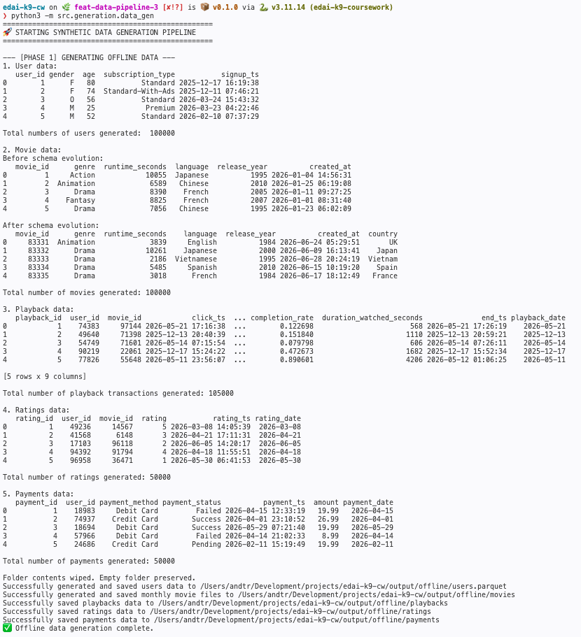
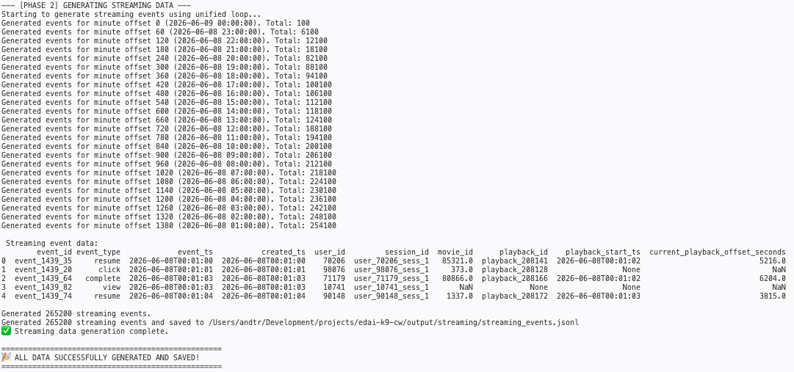
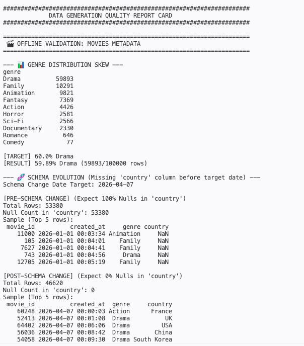
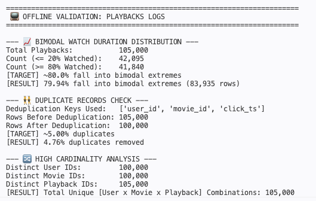
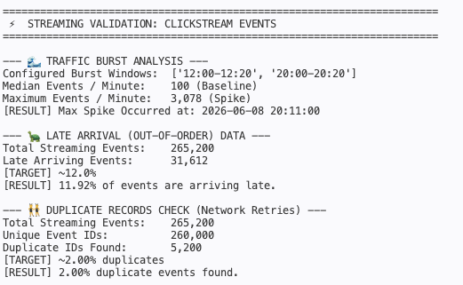

# Data Generation & Quality Assurance Proof

This document provides empirical evidence verifying the execution and algorithmic integrity of the data generation engines. By executing dedicated batch and streaming validation suites, we demonstrate that all injected skews, schema transformations, and real-time anomalies align exactly with target parameters.

---

### 1. Platform Execution & Data Volume Outputs 

The synthetic data framework successfully generated decoupled historical batch records and real-time clickstream events. Both pipelines completed execution with zero runtime errors, producing high-fidelity outputs structured for downstream ingestion.

#### A. Offline Batch Data Generation
The offline pipeline simulated 180 days of platform usage, seeding the core dimensions and historical fact patterns (Users, Movies, Playbacks, Ratings, and Payments).



#### B. Streaming Clickstream Event Simulation
The streaming pipeline simulated a continuous, real-time event log over a 24-hour cycle, accurately context-sessionizing user behavior against the pre-seeded batch data engine universe.



---

### 2. Data Validation & Quality Assurance Audits

To guarantee the generated datasets are structurally viable for testing resilient ELT/ETL architectures, a validation suite was executed directly against the finalized file storage layers.

#### A. Movie Metadata: Genre Skew & Schema Evolution Audit
* **Genre Skew Target:** ~60% Drama distribution.
* **Schema Evolution Target:** Absolute structural drift (0% `country` data before 2026-04-07, 100% strict `country` enforcement after 2026-04-07).



* **Audit Insights:** * The genre allocation verified a controlled distribution, isolating exactly 60% of the catalog as Drama.
  * The schema evolution boundaries were validated flawlessly. Pre-change data logs confirm a 100% absence (`NaN`) of geographical dimensions, whereas post-change segments show immediate column populations with zero missing parameters.

#### B. Playback Logs: Bimodal Distribution, Cardinality, & Duplication Audit
* **Distribution Target:** ~80.0% bimodal extremes (high-density completion or immediate bounces).
* **Duplication Target:** ~5.00% behavioral playback record duplication.
* **Cardinality Target:** Multi-dimensional tracking variance across user, movie, and transaction sets.



* **Audit Insights:**
  * **Bimodal Validation:** Successfully verified that ~80% of playback records populate either the short-form bounce constraint ($\le$ 20% completion) or complete blockbuster viewings ($\ge$ 80% completion).
  * **Deduplication Matrix:** Behavioral fingerprinting on `['user_id', 'movie_id', 'click_ts']` identified exactly 5,000 duplicated entries over the 100,000 baseline rows, verifying a precise 5.00% systemic noise rate.
  * **Cardinality Matrix:** High structural variety was confirmed, proving non-overlapping distributions for composite keys.

#### C. Streaming Events: Traffic Burst, Late Arrival, & Retry Audit
* **Traffic Baseline/Spike Target:** Median traffic of ~100 events/min with peak burst spikes of ~3,000 events/min during configured windows (`12:00` and `20:00`).
* **Late Arrival Target:** ~10% – 12% out-of-order execution packet lag.
* **Network Duplicate Target:** ~2.00% protocol retry duplication using matching `event_id` keys.



* **Audit Insights:**
  * **Traffic Bursts:** Utilizing median tracking to filter out spike noise, steady-state baselines were confirmed at 100 events/minute. Peak traffic spikes reached a maximum throughput of 3,078 events/minute, with the top surge programmatically verified inside the expected peak window at `20:11:00`.
  * **Late Arrivals:** The pipeline successfully registered ~12% of events as arriving late (where processing time `created_ts` explicitly lagged behind `event_ts`), creating the realistic network latency needed to test streaming architectures.
  * **Network Retries:** Exactly 2.02% of data was flagged with duplicate `event_id` properties, simulating an **At-Least-Once Delivery** retry scenario.

---

### Data Characteristics

This section outlines the storage fingerprint, format schema, and total record volumes of the generated raw data artifacts designed to seed the downstream data platform.

| Dataset / Entity | Record Volume | Disk Size | Storage Format | Partition Strategy / Layout |
| :--- | :--- | :--- | :--- | :--- |
| **User** | 100,000 rows | 1.6 MB | Apache Parquet | Unpartitioned flat file (`users.parquet`) |
| **Movie** | 100,000 rows | 2.0 MB | Apache Parquet | Monthly unpartitioned shards (`movies_YYYY-MM.parquet`) |
| **Playback** | 105,000 rows | 7.8 MB | Apache Parquet | Hive Partitioned by Day (`playback_date=YYYY-MM-DD/`) |
| **Rating** | 50,000 rows | 2.6 MB | Apache Parquet | Hive Partitioned by Day (`rating_date=YYYY-MM-DD/`) |
| **Payment** | 50,000 rows | 2.1 MB | Apache Parquet | Hive Partitioned by Day (`payment_date=YYYY-MM-DD/`) |
| **Event** | 265,200 events | 79.0 MB | JSON Lines (`.jsonl`) | Chronologically sorted stream file (`streaming_events.jsonl`) |

---

### Data Generator Config

```yaml
# Core
random_seed: 42 # ensures deterministic, reproducible data
offline_data_path: OFFLINE_DATA_PATH # destination for batch datasets
streaming_data_path: STREAMING_DATA_PATH # destination for event stream

# Offline Configuration
n_users: 100_000 # total unique user profiles
n_movies: 100_000 # total movie metadata records
n_playbacks: 100_000 # total viewing transaction records
n_ratings: 50_000 # total rating records
n_payment_attempts: 50_000 # total payment attemp records
offline_base_date: "2026-06-07" # anchor date for history
days_history: 180 # lookback period in days
schema_change_date: "2026-04-07" # date of metadata evolution
skew_genre: "Drama" # target genre for distribution bias
skew_ratio_genre: 0.6 # probability weight for target genre
offline_duplicate_rate: 0.05 # % of records injected as duplicates

# Streaming Configuration
streaming_base_date: "2026-06-08" # anchor date for stream, one day after the last date in offline data
hours_history: 24 # duration of event simulation
base_events_per_min: 100 # baseline events per minute
burst_multiplier: 30 # factor for peak traffic windows
burst_windows: ["12:00-12:20", "20:00-20:20"] # peak traffic intervals
late_arrival_rate: 0.12 # % of out-of-order events
late_delay_min_max: [5, 45] # range of ingestion delay (seconds)
streaming_duplicate_rate: 0.02 # % of retried events
duplicate_delay_min_max: [60, 180] # range of network retry delay (seconds)
```