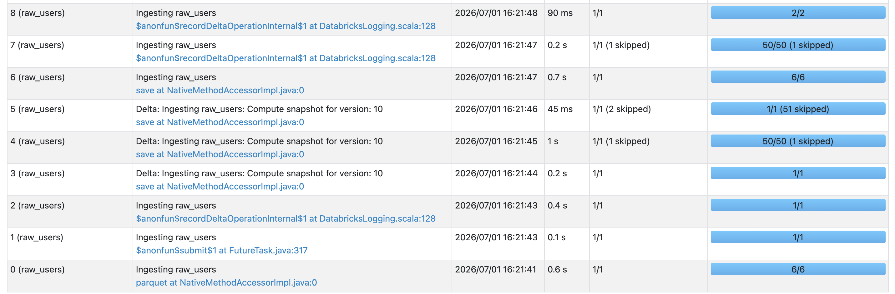
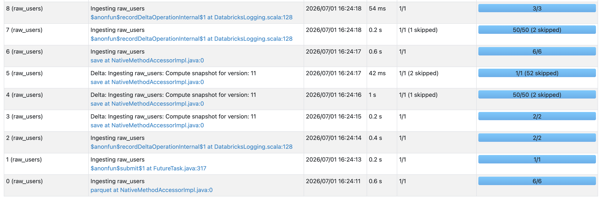

2. Handle schema evolution 

data: user, deal at ingestion 
even though the optimization technique with mergeschema and define deschem doesn't improve the performe 
but it will impact the data integrity new columns are absent entire. 

Baseline with only merge schema 

by adding the schema definition, 

Job 6 (save action): Time dropped from 0.7 seconds in schema_evolution_base_line.png down to 0.6 seconds in schema_evolution_optimized.png.

Job 8 (Final transaction logging): Time dropped from 90 ms in the baseline down to 54 ms in the optimized version.

3. Better Task Parallelism & Resource Distribution
If you look closely at the blue progress bars on the right side of both images, you can see that Spark's Catalyst Optimizer is distributing tasks much more effectively in the optimized version:

Job 2 & Job 3: Ran as single standalone tasks (1/1) in schema_evolution_base_line.png, but increased to parallelized tasks (2/2) in schema_evolution_optimized.png.

Job 8: Shifted from 2/2 tasks in the baseline to a broader 3/3 tasks in the optimized run.

This indicates that your code structure now allows Spark to maximize internal thread utilization rather than processing sequential metadata validations.